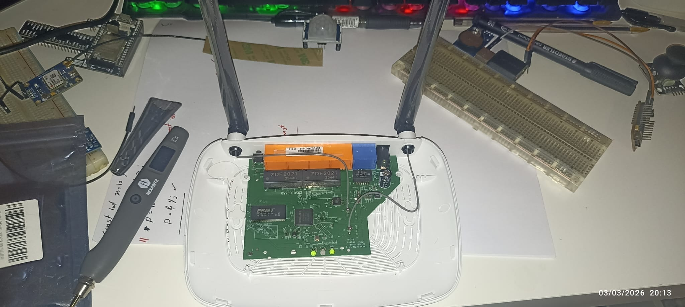
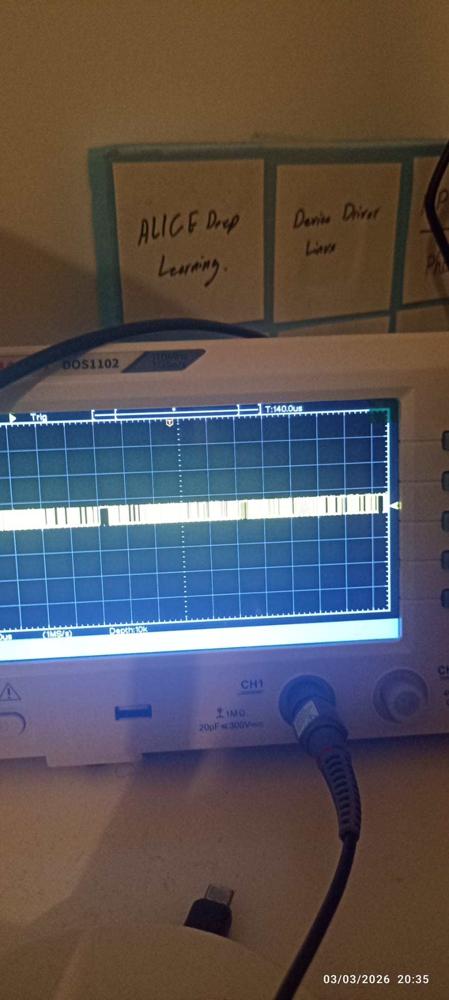
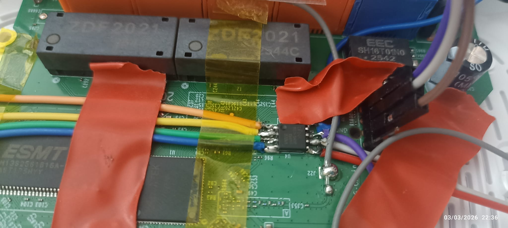
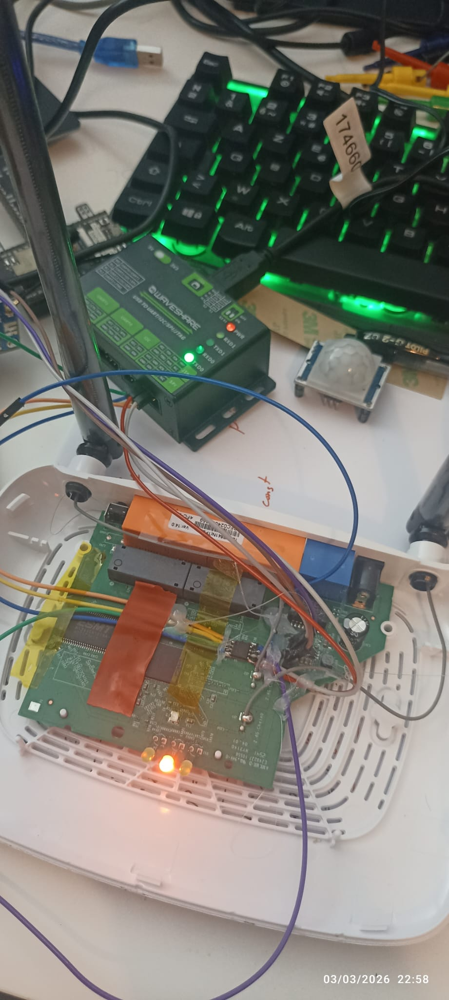

# TP-Link Router Firmware Extraction & Analysis via Hardware Hacking

> A hands-on hardware security research project: extracting and analyzing firmware from a TP-Link wireless router by accessing UART, dumping SPI flash, and reverse engineering the embedded Linux filesystem.

## Target Device

| Property | Value |
|----------|-------|
| **SoC** | MediaTek MT7628AN (Ralink APSoC) |
| **CPU** | MIPS 24Kc @ 580 MHz |
| **RAM** | 32 MB DDR (ESMT, 256 Mbit, 16-bit bus) |
| **Flash** | 8 MB SPI NOR — EN25QX64A (Eon Silicon) |
| **Bootloader** | U-Boot 1.1.3 (Ralink UBoot 4.3.0.0) |
| **Kernel** | Linux 2.6.36 (MIPS32 rel2) |
| **Root FS** | SquashFS 4.0 |
| **C Library** | uClibc 0.9.33.2 |
| **Wireless** | MT7628 2.4 GHz 802.11n (2T2R) |
| **Build Date** | Nov 19, 2023 |

---

## Overview

The goal of this project was to extract the full firmware from a TP-Link router through hardware-level access. The router's UART console was accessible but the interactive shell was blocked — the system prompts `Please press Enter to activate this console` but never provides a usable shell. This led me to take the direct approach: **desolder/clip onto the SPI flash chip and dump the firmware externally**.

### What I Did

1. **Disassembled** the router and identified the PCB components
2. **Located the UART pins** and connected via USB-to-serial adapter at 115200 baud
3. **Captured the boot log** (full output in [`console.txt`](console.txt)) — confirmed the hardware specs but could not get an interactive shell
4. **Verified UART signals** with an oscilloscope to confirm baud rate and signal integrity
5. **Identified the SPI flash** chip (EN25QX64A) and wired it to an external SPI programmer
6. **Dumped the full 4 MB firmware** from the flash chip
7. **Extracted all partitions**: U-Boot, kernel, rootfs (SquashFS), config, radio calibration data
8. **Mounted and analyzed the root filesystem** — examined binaries, configs, startup scripts, and web interface

---

## Step 1: Opening the Router & PCB Reconnaissance

Removed the case to expose the PCB. Key components identified:

- **MT7628AN** SoC (main processor, under the RF shield)
- **ESMT M13S2561616A** — 32 MB DDR SDRAM
- **EN25QX64A** — 8 MB SPI NOR flash (8-pin SOIC package)
- **ZDF2021** dual Ethernet transformers
- Two external 2.4 GHz antennas (2T2R MIMO)


*Router with case removed — PCB visible with ESMT RAM, SPI flash, MT7628 SoC, and Ethernet transformers*

---

## Step 2: UART Access & Boot Log Capture

### Finding UART

The MT7628 exposes two UART ports:
- **ttyS0** at MMIO `0x10000d00` (IRQ 21)
- **ttyS1** at MMIO `0x10000c00` (IRQ 20) — **this is the console**

The kernel command line confirms: `console=ttyS1,115200`

### Connection

Connected a USB-to-serial adapter (3.3V logic level) to the UART TX/RX/GND pads on the PCB.

**Settings:** 115200 baud, 8N1

### What the Console Showed

The full boot log is captured in [`console.txt`](console.txt). Key observations:

```
U-Boot 1.1.3 (Nov 19 2023 - 18:30:02)
Board: Ralink APSoC DRAM:  32 MB
ASIC 7628_MP (Port5<->None)
Flash component: SPI Flash
```

The system boots through U-Boot, loads the kernel, mounts SquashFS rootfs, and starts all services. At the end:

```
Please press Enter to activate this console.
```

But the `inittab` configuration blocks interactive access:
```
ttyS1::askfirst:/bin/login
```

It requires login credentials, and the shell interaction was not responsive — **the interactive console was effectively locked down**.

### Verifying the Signal

Used a **DOS1102 oscilloscope** to verify the UART signal on the TX line, confirming 115200 baud rate and clean signal transitions.


*Oscilloscope capture of UART TX signal — confirming 115200 baud data transmission*

---

## Step 3: SPI Flash Firmware Extraction

Since the UART shell was blocked, the next approach was to **read the firmware directly from the SPI flash chip**.

### Identifying the Flash Chip

From the boot log:
```
flash manufacture id: 1c, device id 70 16
EN25QX64A(1c 71171c71) (8192 Kbytes)
```

The chip is an **Eon EN25QX64A** — an 8 MB SPI NOR flash in an 8-pin SOIC package. It uses standard SPI protocol (MOSI, MISO, CLK, CS#).

### Wiring to SPI Programmer

I soldered jumper wires directly to the SPI flash chip pins on the PCB and connected them to a **Waveshare SPI programmer**:

| SPI Flash Pin | Signal | Wire Color | Programmer Pin |
|---------------|--------|------------|----------------|
| 1 | CS# (Chip Select) | — | CS |
| 2 | MISO (Data Out) | — | MISO |
| 5 | MOSI (Data In) | — | MOSI |
| 6 | CLK (Clock) | — | CLK |
| 4 | GND | — | GND |
| 8 | VCC (3.3V) | — | 3.3V |

> **Important:** The router must be **powered off** during SPI flash reading. The SPI programmer provides its own 3.3V to the flash chip. If the SoC is powered, it will conflict on the SPI bus.


*Close-up of the SPI flash chip (EN25QX64A) with jumper wires soldered to SOIC-8 pins for external reading. Ethernet transformer (SH16T01N0) and ESMT RAM visible.*


*Complete setup — router PCB connected via jumper wires to Waveshare SPI programmer (USB), reading firmware through the host machine*

### Reading the Flash

Using the SPI programmer software, I dumped the entire flash contents:

```bash
# The full 4MB firmware dump
tp_link_firmware.bin   # 4,194,304 bytes (4 MB)
```

---

## Step 4: Firmware Partition Extraction

The MT7628 U-Boot divides the flash into 5 MTD partitions. From the boot log:

```
Creating 5 MTD partitions on "raspi":
0x000000000000-0x000000010000 : "boot"      # U-Boot bootloader
0x000000010000-0x000000100000 : "kernel"    # Linux kernel (compressed)
0x000000100000-0x0000003e0000 : "rootfs"    # SquashFS root filesystem
0x0000003e0000-0x0000003f0000 : "config"    # Device configuration
0x0000003f0000-0x000000400000 : "radio"     # Wireless calibration/EEPROM
```

I split the firmware dump according to these offsets:

```bash
# Extract each partition from the raw dump
dd if=tp_link_firmware.bin of=uboot.bin         bs=1 count=65536    skip=0
dd if=tp_link_firmware.bin of=kernel.bin         bs=1 count=983040   skip=65536
dd if=tp_link_firmware.bin of=rootfs.squashfs    bs=1 count=3145728  skip=1048576
dd if=tp_link_firmware.bin of=config.bin         bs=1 count=65536    skip=4063232
dd if=tp_link_firmware.bin of=radio.bin          bs=1 count=65536    skip=4128768
```

### Partition Summary

| Partition | File | Offset | Size | Description |
|-----------|------|--------|------|-------------|
| boot | `uboot.bin` | 0x000000 | 64 KB | U-Boot 1.1.3 bootloader |
| kernel | `kernel.bin` | 0x010000 | 960 KB | Linux 2.6.36 compressed kernel image |
| rootfs | `rootfs.squashfs` | 0x100000 | ~2.9 MB | SquashFS 4.0 root filesystem |
| config | `config.bin` | 0x3E0000 | 64 KB | Runtime configuration (XML-based) |
| radio | `radio.bin` | 0x3F0000 | 64 KB | MT7628 wireless calibration data |

---

## Step 5: Root Filesystem Analysis

### Extracting SquashFS

```bash
unsquashfs rootfs.squashfs
# Extracts to rootfs/ directory
```

### Filesystem Structure

```
rootfs/
├── bin/          # BusyBox symlinks (ash, cat, ls, sh, ping, etc.)
├── dev/          # Device nodes
├── etc/          # Configuration (init scripts, wireless profiles, XML data model)
├── lib/          # uClibc 0.9.33.2 + TP-Link proprietary libs (libcmm.so, libgdpr.so)
├── sbin/         # System tools (mii_mgr, switch, busybox symlinks)
├── usr/bin/      # Main daemons (httpd, cos, dropbear, dhcpd, dnsProxy, tddp, etc.)
├── var/          # Symlinked to tmpfs at runtime
└── web/          # Web management interface (HTML/JS)
```

### Key Findings

#### 1. BusyBox (Minimal Shell Environment)
All basic utilities are BusyBox symlinks — a single 256 KB MIPS32 binary providing `sh`, `ls`, `cat`, `mount`, `ping`, etc.

```
rootfs/bin/busybox: ELF 32-bit LSB executable, MIPS, MIPS32 rel2 version 1
```

#### 2. Default Credentials in passwd.bak
```
admin:$1$$iC.dUsGpxNNJGeOm1dFio/:0:0:root:/:/bin/sh
```
The admin account runs as **UID 0 (root)** with an MD5-crypt password hash. This is the same credential used for the web interface and (potentially) SSH/Telnet.

#### 3. Boot Sequence (inittab + rcS)

**`/etc/inittab`:**
```
::sysinit:/etc/init.d/rcS
ttyS1::askfirst:/bin/login
```

**`/etc/init.d/rcS`** — the startup script:
- Mounts filesystems, creates tmpfs directories
- Loads kernel modules: Ethernet (`raeth.ko`), netfilter, GRE, L2TP
- Configures networking (IP forwarding, conntrack limits)
- Launches **`cos`** — the main TP-Link management daemon that orchestrates everything

#### 4. Main Daemon: `cos`
The `cos` binary (in `/usr/bin/`) is TP-Link's proprietary Configuration and Operation System. It:
- Reads `/etc/reduced_data_model.xml` (the device's TR-069/CWMP-style data model)
- Loads configuration from the `config` flash partition
- Starts network interfaces (WAN, LAN bridge, VLANs)
- Loads the Wi-Fi driver (`mt_wifi.ko`) and configures it
- Starts sub-services: DHCP, DNS proxy, firewall (iptables/ip6tables/ebtables), UPnP, Dropbear SSH, NTP, HTTP server

#### 5. Network Architecture
```
                    ┌─────────────────────────────┐
                    │        MT7628AN SoC          │
                    │                              │
  WAN (eth0.2) ────┤  VLAN 2 ──── NAT/Firewall   │
                    │                              │
  LAN1 (eth0.3) ───┤                              │
  LAN2 (eth0.4) ───┤  VLANs 3-6 ── br0 bridge ──│──── 192.168.0.1
  LAN3 (eth0.5) ───┤                              │
  LAN4 (eth0.6) ───┤                              │
                    │  ra0 (2.4GHz WiFi) ── br0   │
                    └─────────────────────────────┘
```

#### 6. Services Running
| Service | Binary | Purpose |
|---------|--------|---------|
| cos | `/usr/bin/cos` | Main management daemon |
| httpd | `/usr/bin/httpd` | Web management interface |
| dropbear | `/usr/bin/dropbear` | SSH server (port 22) |
| dhcpd | `/usr/bin/dhcpd` | DHCP server for LAN |
| dnsProxy | `/usr/bin/dnsProxy` | DNS forwarding proxy |
| wscd | `/usr/bin/wscd` | WPS daemon |
| tddp | `/usr/bin/tddp` | TP-Link Device Debug Protocol |
| tdpd | `/usr/bin/tdpd` | TP-Link Device Protocol daemon |
| igmpd | `/usr/bin/igmpd` | IGMP multicast proxy |

#### 7. Proprietary Libraries
| Library | Size | Purpose |
|---------|------|---------|
| `libcmm.so` | 894 KB | Configuration Management Module — core logic |
| `libgdpr.so` | 403 KB | GDPR compliance / data handling |
| `libupnp.so` | 279 KB | UPnP stack |
| `libos.so` | 29 KB | OS abstraction layer |
| `libcutil.so` | 50 KB | Utility functions |

---

## Tools Used

| Tool | Purpose |
|------|---------|
| Screwdrivers / pry tools | Router disassembly |
| USB-to-Serial adapter (3.3V) | UART console access |
| DOS1102 Oscilloscope | Signal verification (baud rate confirmation) |
| Waveshare SPI Programmer | SPI flash chip reading |
| Soldering iron + jumper wires | Connecting to SPI flash pins |
| `dd` | Firmware partition splitting |
| `unsquashfs` | SquashFS root filesystem extraction |
| `file`, `hexdump`, `strings` | Binary analysis |

---

## Files in This Repository

```
├── README.md                 # This tutorial
├── tp_link_firmware.bin      # Full 4 MB SPI flash dump
├── uboot.bin                 # Extracted U-Boot bootloader (64 KB)
├── kernel.bin                # Extracted Linux kernel (960 KB)
├── rootfs.squashfs           # Extracted SquashFS image
├── config.bin                # Device configuration partition (64 KB)
├── radio.bin                 # Wireless calibration data (64 KB)
├── console.txt               # Full UART boot log capture
├── rootfs/                   # Extracted root filesystem tree
│   ├── bin/                  # BusyBox utilities
│   ├── etc/                  # Configuration files, init scripts
│   ├── lib/                  # uClibc + proprietary libraries
│   ├── usr/bin/              # Main daemons and tools
│   └── web/                  # Web management interface
└── images/                   # Photos from the hardware hacking process
    ├── 01_router_pcb_overview.jpg
    ├── 02_uart_signal_oscilloscope.jpg
    ├── 03_spi_flash_wiring_closeup.jpg
    └── 04_spi_programmer_full_setup.jpg
```

---

## Step 6: Cracking the Admin Password

Inside the extracted rootfs, the file `etc/passwd.bak` contains the default credentials:

```
admin:$1$$iC.dUsGpxNNJGeOm1dFio/:0:0:root:/:/bin/sh
```

### Breaking Down the Hash

The hash format is `$1$$iC.dUsGpxNNJGeOm1dFio/` which tells us:
- **`$1$`** — This is an **MD5-crypt** hash (a weak, outdated hashing algorithm)
- **`$$`** — The salt between the two `$` signs is **empty** — this is a critical weakness, as salts are meant to make each hash unique and prevent precomputation attacks
- **`iC.dUsGpxNNJGeOm1dFio/`** — The actual hash digest

### Cracking with Python

Since MD5-crypt with an empty salt is extremely weak, we can crack it in seconds by testing common passwords. Python's `crypt` module can generate MD5-crypt hashes with the same algorithm and compare:

```python
import crypt

# The hash extracted from the firmware
target_hash = '$1$$iC.dUsGpxNNJGeOm1dFio/'

# The salt format for MD5-crypt with empty salt
salt = '$1$$'

# Dictionary of common default passwords
wordlist = ['admin', '', 'password', '1234', 'root', 'tplink', 'tp-link']

for password in wordlist:
    # crypt.crypt() generates a hash using the same algorithm and salt
    generated_hash = crypt.crypt(password, salt)
    if generated_hash == target_hash:
        print(f'PASSWORD CRACKED: "{password}"')
        break
```

**How it works:**
1. `crypt.crypt(password, salt)` takes a candidate password and the salt format (`$1$$` = MD5-crypt, empty salt)
2. It generates a hash using the **same algorithm** the router used when it originally stored the password
3. If the generated hash **matches** the hash from the firmware, we found the password

### Result

```
PASSWORD CRACKED: "1234"
```

| Field | Value |
|-------|-------|
| **Username** | `admin` |
| **Password** | `1234` |
| **UID** | 0 (root) |
| **Shell** | `/bin/sh` |

This password grants **full root access** to the device — web interface, SSH (Dropbear on port 22), and the UART console that was previously blocking us.

### Why This Is a Security Problem

- The password hash uses **MD5-crypt** — broken and deprecated since 2012
- The salt is **empty** — eliminates the entire purpose of salting
- The password `1234` is trivially guessable even without hash cracking
- The admin account runs as **UID 0 (root)** — there is no privilege separation
- The same credential is used for **all access methods** (web, SSH, UART, telnet)

---

## Step 7: Extracting Every Secret from the Firmware

After cracking the admin password, I performed a full credential audit across the entire firmware — searching every binary, config file, and script using `strings` and `grep`. Here is everything I found.

### 7.1 — Default WiFi Password (WPA-PSK)

**File:** `rootfs/etc/RT2860AP.dat` (MediaTek wireless driver configuration)

```ini
SSID1=RTDEV_AP
AuthMode=OPEN
EncrypType=NONE
WPAPSK1=12345678
```

The default WPA Pre-Shared Key is hardcoded as `12345678`. Even though the default mode is OPEN (no encryption), when a user enables WPA/WPA2 security through the web interface, this is the starting PSK. Many users never change it.

**How I found it:** Running `strings` on the wireless config file and searching for key-related fields:
```bash
strings rootfs/etc/RT2860AP.dat | grep -iE 'WPAPSK|Key|SSID'
```

| Field | Value |
|-------|-------|
| **Default SSID** | `RTDEV_AP` |
| **Default WPA-PSK** | `12345678` |
| **Auth Mode** | OPEN (no encryption by default) |

---

### 7.2 — WPS Key (Wi-Fi Protected Setup)

**File:** `rootfs/etc/RT2860AP.dat`

```ini
WscNewKey=scaptest
WscConfMode=0
WscConfigured=0
```

`WscNewKey` is the key that WPS uses when configuring a new wireless client. The value `scaptest` appears to be a development/test key left in from manufacturing.

**How I found it:**
```bash
strings rootfs/etc/RT2860AP.dat | grep -i Wsc
```

This is significant because WPS has known vulnerabilities (Reaver/Pixie-Dust attacks), and having a predictable key makes it even weaker.

---

### 7.3 — SSH (Dropbear) Credentials

**Source:** `rootfs/lib/libcmm.so` (TP-Link's core configuration library)

By running `strings` on the main configuration library:
```bash
strings rootfs/lib/libcmm.so | grep -A2 -B2 dropbearpwd
```

Output:
```
uname = %s, pswd = %s
/var/tmp/dropbear/dropbearpwd
username:%s
password:%s
```

The boot sequence (visible in `console.txt`) shows:
```
prepareDropbear cmd is "dropbear -p 22 -r /var/tmp/dropbear/dropbear_rsa_host_key
  -d /var/tmp/dropbear/dropbear_dss_host_key -A /var/tmp/dropbear/dropbearpwd"
```

**What this means:** At boot, the `cos` daemon writes the admin username and password (`admin`/`1234`) in plaintext to `/var/tmp/dropbear/dropbearpwd`. Dropbear SSH reads this file for authentication (`-A` flag). The SSH credentials are **identical** to the web admin credentials — same `admin`/`1234`.

| Field | Value |
|-------|-------|
| **SSH Port** | 22 |
| **Username** | `admin` |
| **Password** | `1234` |
| **Auth file** | `/var/tmp/dropbear/dropbearpwd` (plaintext) |

---

### 7.4 — TP-Link Tether App Encryption Key

**Source:** `rootfs/usr/bin/tdpd` (TP-Link Device Protocol daemon)

```bash
strings rootfs/usr/bin/tdpd | grep -i tether
```

Output:
```
TETHER_KEY_V1_(%s)
```

The `tdpd` daemon handles communication with the **TP-Link Tether** mobile app. The encryption key used to secure this communication is derived from the device's MAC address using the format:

```
TETHER_KEY_V1_(B8:FB:B3:54:35:FA)
```

The MAC address is read from flash at offset `0x3FF100` (visible in `console.txt`):
```
Read MAC from flash(3ff100) b8-fb-b3-54-35-fa
```

**How to derive the key:**
```python
import hashlib

mac = "B8:FB:B3:54:35:FA"  # from flash dump
tether_key = f"TETHER_KEY_V1_({mac})"
# The key is then MD5-hashed for use as a DES/AES key
key_hash = hashlib.md5(tether_key.encode()).hexdigest()

print(f"Tether key string: {tether_key}")
print(f"Tether key MD5:    {key_hash}")
```

```
Tether key string: TETHER_KEY_V1_(B8:FB:B3:54:35:FA)
Tether key MD5:    82727eccff0d5b1179df3b347fdb8e8c
```

**Why this is a problem:** Anyone who knows the device's MAC address (broadcast in every WiFi frame) can derive the Tether encryption key and intercept/forge commands to the router from the mobile app.

---

### 7.5 — Web Interface Authentication Mechanism

**Source:** `rootfs/web/js/tpEncrypt.js` + `rootfs/usr/bin/httpd`

By analyzing the JavaScript and the `httpd` binary:
```bash
strings rootfs/usr/bin/httpd | grep -iE 'admin|auth|aes|rsa|md5'
```

The web login works as follows:

1. The browser computes `MD5(username + password)` as an auth hash
2. The server generates an RSA public key and sends it to the browser
3. The browser generates a random AES-128-CBC key
4. The AES key + auth hash are encrypted with RSA and sent to the server
5. All subsequent communication is AES-encrypted

```python
import hashlib

username = "admin"
password = "1234"
auth_hash = hashlib.md5((username + password).encode()).hexdigest()
print(f"Web auth hash = MD5(\"{username}{password}\") = {auth_hash}")
```

```
Web auth hash = MD5("admin1234") = c93ccd78b2076528346216b3b2f701e6
```

While the transport encryption (RSA + AES) is reasonable, the underlying auth is just MD5 of the credentials — no per-session salt, no PBKDF, no rate limiting beyond a simple `forbidTime` counter.

---

### 7.6 — Device MAC Addresses (from Flash)

**Source:** `console.txt` (UART boot log) + flash dump at offset `0x3FF100`

```
Read MAC from flash(3ff100) B8:FB:B3:54:35:FA    # LAN MAC
ifconfig eth0.2 hw ether B8:FB:B3:54:35:FB        # WAN MAC (LAN + 1)
```

| Interface | MAC Address | Purpose |
|-----------|-------------|---------|
| LAN (br0) | `B8:FB:B3:54:35:FA` | Bridge interface (WiFi + LAN ports) |
| WAN (eth0.2) | `B8:FB:B3:54:35:FB` | Internet-facing interface |

The WAN MAC is simply the LAN MAC + 1. Both are stored at flash offset `0x3FF100` inside the `radio` partition.

---

### 7.7 — TDDP Debug Protocol

**Source:** `rootfs/usr/bin/tddp`

```bash
strings rootfs/usr/bin/tddp | grep -iE 'admin|password'
```

```
admin
adminName
adminPwd
```

The **TP-Link Device Debug Protocol** (`tddp`) listens on **UDP port 1040** and uses the same admin credentials. This protocol has been the target of multiple CVEs (e.g., CVE-2019-17147) allowing unauthenticated remote code execution on TP-Link devices. It is enabled by default.

---

### Complete Credentials Summary

| # | Secret | Value | Found In | Method |
|---|--------|-------|----------|--------|
| 1 | **Admin password** | `1234` | `etc/passwd.bak` | MD5-crypt hash cracked with Python |
| 2 | **Default WiFi PSK** | `12345678` | `etc/RT2860AP.dat` | `strings` on config file |
| 3 | **WPS setup key** | `scaptest` | `etc/RT2860AP.dat` | `strings` on config file |
| 4 | **SSH password** | `1234` (same as admin) | `lib/libcmm.so` | `strings` revealed dropbear password path |
| 5 | **Tether app key** | `TETHER_KEY_V1_(B8:FB:B3:54:35:FA)` | `usr/bin/tdpd` | `strings` + MAC from boot log |
| 6 | **Web auth hash** | `c93ccd78b2076528346216b3b2f701e6` | `web/js/tpEncrypt.js` | Reverse-engineered JS auth flow |
| 7 | **LAN MAC** | `B8:FB:B3:54:35:FA` | `console.txt` / flash `0x3FF100` | Boot log analysis |
| 8 | **WAN MAC** | `B8:FB:B3:54:35:FB` | `console.txt` | Boot log analysis |
| 9 | **TDDP uses admin creds** | `admin` / `1234` | `usr/bin/tddp` | `strings` on binary |

---

## Security Observations

1. **Hardcoded credentials** — The admin password hash (`1234`) is stored in `passwd.bak` within the firmware image, crackable in seconds with a simple Python script.

2. **Root-level admin** — The admin user runs as UID 0 (root), meaning web interface compromise equals full device control.

3. **UART console present but locked** — The UART login prompt exists but doesn't grant shell access without credentials. However, since the credentials are embedded in the firmware, dumping the flash defeats this protection. With the cracked password `1234`, we can now log in via UART as well.

4. **Legacy kernel** — Linux 2.6.36 (released 2010) lacks over a decade of security patches, including many known privilege escalation and remote exploits.

5. **No firmware signing** — The flash contents are not cryptographically signed or encrypted, allowing straightforward extraction and potential modification/reflashing.

6. **Debug protocols exposed** — `tddp` (TP-Link Device Debug Protocol) runs by default, which has been associated with known vulnerabilities in TP-Link devices.

---

## Lessons Learned

- When UART is locked, **SPI flash extraction is a reliable fallback** — the firmware is stored in plaintext on the flash chip
- Identifying the flash chip from the boot log (`flash manufacture id`) before physically inspecting saves time
- The MT7628 platform is widely used in budget routers — skills here transfer to many similar devices
- SquashFS is read-only by design, so runtime changes use tmpfs overlays (`/var/tmp/`)
- The proprietary `cos` daemon is the single point of control — understanding it is key to understanding the device

---

*This project demonstrates hardware security assessment skills including PCB analysis, UART debugging, SPI flash extraction, firmware reverse engineering, and embedded Linux filesystem analysis.*
# tplink-firmware-reversing
